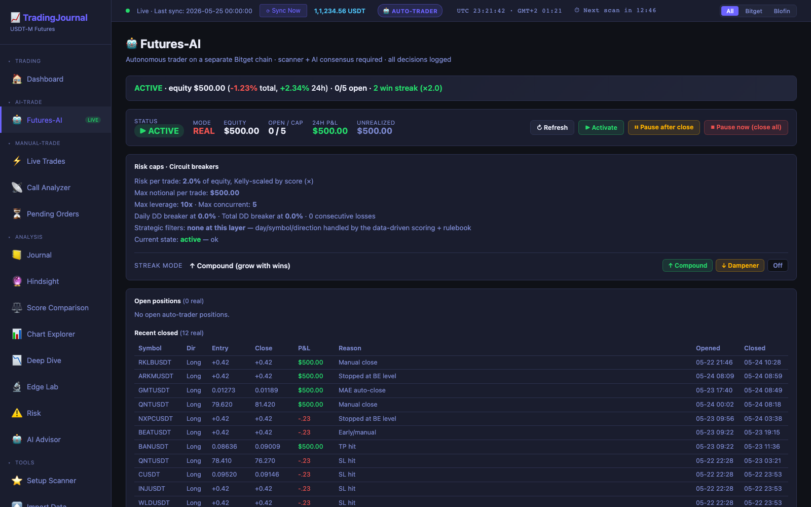
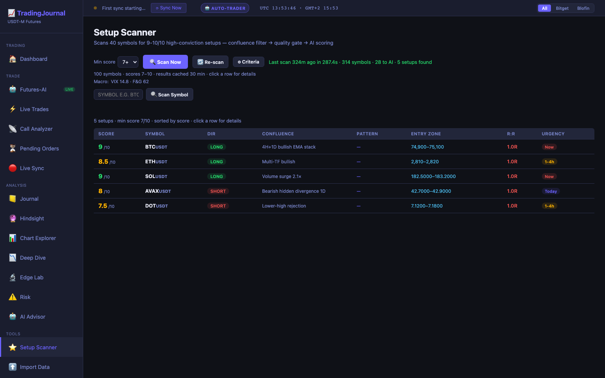
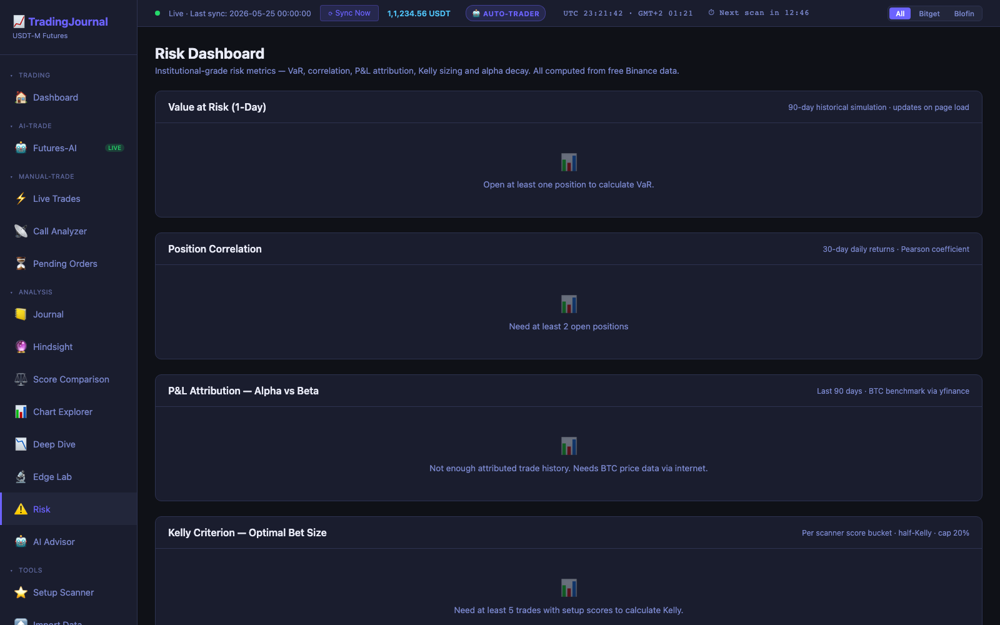
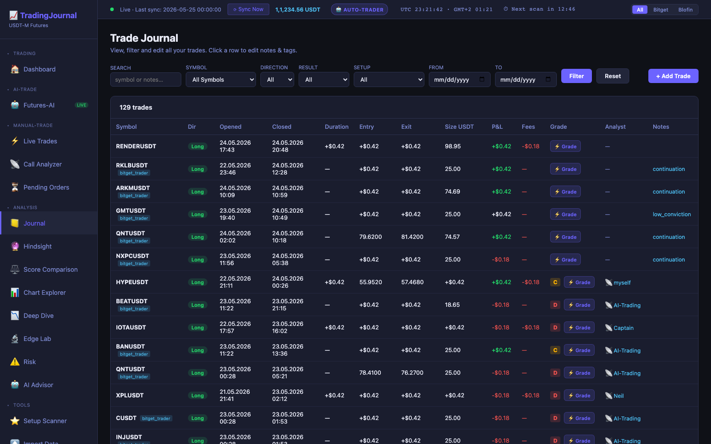

# Trading Journal

> **Disclaimer:** Vibe-coded with [Claude Code](https://claude.ai/code). Not reviewed by professional security experts. Use at your own risk.

> **Disclaimer: Automatic AI trading** I recommend to start with paper trading first (integrated feature), to get a good knowledge about scoring decisions and workflows. Risk (if hit at hard SL) ist hardcoded: max. 1% on single entry, max. 2% if DCA strategy is activated.<br>
This tool was made for learning purposes. If you want to use the trading feature with real money - your decision...

Self-hosted crypto futures trading journal with live exchange sync, a 7-agent AI pipeline, interactive Telegram assistant, and deep performance analytics. Runs on a Raspberry Pi 5 (or any Linux box).
<br>

<p align="center">
  <a href="docs/architecture.md">Architecture Doc</a> ·
  <a href="docs/USER_GUIDE.md">User Guide</a> ·
  <a href="docs/MODULE_MAP.md">Module Map</a>
</p>

---

## 🎬 Feature Tour

The autonomous Bitget chain — equity, breakers, open positions, decision log, and the catastrophe-hedge state all in one screen:

<p align="center">
  
</p>

<table>
<tr>
<td width="50%" valign="top">

### 🔭 Setup Scanner

Three-stage pipeline filters 300+ symbols every 30 min. Surfaces only high-conviction setups (score ≥ 7) with R:R, urgency, and the confluence reasoning that fired each pick.



</td>
<td width="50%" valign="top">

### 🛡 Risk Dashboard

Institutional-grade portfolio metrics — VaR, position correlation, P&L attribution vs BTC benchmark, and Kelly-criterion bet sizing. All computed from free Binance public data.



</td>
</tr>
<tr>
<td colspan="2" valign="top">

### 📖 Trade Journal

Full history across both exchanges with rich filters: search · symbol · direction · result · setup-type · date range. Click any row to add notes, tags, or grade the execution.



</td>
</tr>
</table>

<details>
<summary><b>📊 What else is in the box</b> (click to expand)</summary>

- **Dashboard** — KPIs, monthly target tracker, equity curve, wallet history, current streak, recent trades
- **Deep Dive Analytics** — breakdown by symbol / month / hour / setup type; worst-symbol identification
- **Edge Lab** — setup-type analysis, execution-grade impact, AI pattern detector, planned-vs-realized R:R
- **Chart Explorer** — LightweightCharts popup with S/R overlay, WaveTrend pane, at-level highlights, FVG zones
- **Call Analyzer** — paste an analyst call → instant 7-agent AI scoring + annotated chart
- **Hindsight Analysis** — retroactive trade re-scoring with full chart context at entry time
- **Pending Limit Orders** — pop-out chart per order + AI verdict with retry hint on truncated responses
- **Live Sync** — Bitget USDT-M + Blofin every 5 min; CSV import for historical
- **Data Sources** — interactive reference of all 14 fan-in clients (Coinalyze, Nansen, CoinGecko, CoinMetrics, etc.)
- **Settings** — token-usage dashboard with per-module spend, prompt-cache hit rate, runway estimate

> Numbers shown in screenshots are illustrative — wired to local demo data, not real account state.

</details>

---

## Features

- **Trade Journal** — Bitget USDT-M + Blofin sync (5 min cadence), CSV import, per-trade notes/tags/setup type
- **Dashboard & Analytics** — P&L, win rate, Sharpe, Calmar, drawdown overlay, Deep Dive breakdown by symbol/month/hour/setup
- **7-Agent AI Pipeline** — DataCollector → Interpreter → Sentiment → Reviewer → RiskMgmt → TradePrep → TradeMonitor; typed contracts, parallel fetch
- **Setup Scanner** — 100+ USDT-M symbols, 3-stage pipeline (confluence → quality gate → Haiku/Sonnet), HTF→LTF (1D/4H/1H) breakdown, Telegram alerts with annotated chart, cancel button
- **Annotated Charts** — mplfinance PNG: entry zone band, S/R zones (A-F, color-coded), direction badge, TP1/TP2 colors, ATR-based width, confluence merging
- **Live Chart Popup** — LightweightCharts with direction badge, S/R overlay, WaveTrend pane, at-level highlights
- **Dominance Dashboard** — BTC.D, ETH.D, USDT.D, OTHERS.D, TOTAL2, TOTAL3, MEME.C, STABLE.C.D, ES1! via `/api/market/dominances`
- **Backtester + Optimizer** — vectorized 4H backtest, Optuna Bayesian optimizer, walk-forward validation
- **AI Learning** — personalised rulebook, hindsight scoring, token usage dashboard, prompt caching (40-60% savings)
- **Hermes Bot** — interactive Telegram assistant (separate from alert bot); queries journal API, sends charts, runs scans, tracks behavioral stats
- **12-Signal Confluence Engine** — liquidation cluster walls (11th signal), order flow delta/divergence (12th signal); HMM 3-state regime detection (trending/ranging/volatile) injected into every AI prompt
- **On-Chain Metrics** — MVRV, exchange net-flow via CoinMetrics Community API (keyless); injected as macro context
- **ML Win-Probability Scorer** — XGBoost trained on historical outcomes; predicts win probability per setup, injected into prompts after 20+ labeled trades
- **Backtesting Quality** — PBO (Probability of Backtest Overfitting), Deflated Sharpe, Bootstrap CI via `POST /api/backtest/quality`
- **Structured AI Rubrics** — 6-section technical analyst template (TREND/MOMENTUM/STRUCTURE/SIGNAL COUNT/BIAS/CONFIDENCE) + explicit risk decision table in agent_trade_prep.py
- **Browser Accessibility Baseline** — 16/16 tabs clean, 4/4 pages 100% accessibility score, 42 aria-label fixes across all form inputs
- **Gemini AI Fallback** — `ai_client.send()` transparently retries on any Anthropic API error; all 10+ AI modules get fallback with no code changes required
- **Chart Legend Panel** — `?` button in every chart popup opens a toggleable reference panel explaining all abbreviations (S/R, Fib, WaveTrend, liquidation, trendlines, etc.) with color-coded visual indicators
- **Scanner Stale-Alert Guard** — 4-layer price proximity filter drops setups where entry is missing, >20% from current price, >5% directional drift, or price fetch fails; fixes false Telegram alerts on stale scanner setups
- **Pending Orders UX** — pop-out button on chart thumbnail opens full interactive chart; AI verdict JSON display fix with retry hint on truncated Gemini responses
- **Futures-AI Auto-Trader** — autonomous Bitget chain (separate subaccount) consuming scanner output. Pipeline: scanner → Sonnet consensus → kill-switch → Kelly-scaled sizing → live Bitget order with ATR-based SL/TP plan orders → BE/Trail/MAE lifecycle → post-trade reflection. Two-chain DB isolation (`positions.chain = 'manual' | 'auto_ai'`) keeps manual hindsight/rulebook/learnings separate from AI ones while sharing market data, scanner, and baselines.
- **Auto-Trader Risk Envelope** — 2% risk-per-trade (Kelly-scaled 1.0×/1.5×/2.0× by score), $25 notional cap, 10× max leverage, 5 concurrent positions (soft cap), 7 hard cap when a scanner-verified 10/10 setup unlocks the elite-bypass slot. Circuit breakers: -5% daily DD, -15% total DD, 3 consecutive losses. All decisions land in `futures_ai_log` with full audit trail.

---

## Tech Stack

| Layer | Technology |
|-------|-----------|
| Backend | Python 3.13 / Flask 3.1 / SQLite WAL |
| Frontend | Vanilla JS SPA (17 modules, no build step) |
| Charts | LightweightCharts v4.1.3 + mplfinance |
| AI — analysis | Claude Sonnet 4.6 |
| AI — fast scoring | Claude Haiku 4.5 |
| AI — consensus | Google Gemini 2.0 Flash |
| AI — social | xAI Grok (X/Twitter sentiment) |
| On-chain | Nansen.ai smart money |
| Market data | Binance · Bitget · Bybit · OKX · Coinalyze · CoinGecko · yfinance |
| ML / Regime | `hmmlearn` · `scikit-learn` · `xgboost` · `joblib` |
| Alerts | Telegram Bot API |
| Host | Raspberry Pi 5 / systemd |

---

## Key Modules

- `ai_scanner.py` + `scanner_stages.py` — 3-stage scanner with cancel event, macro cap, HTF→LTF
- `agent_chart_draw.py` — annotated PNG with entry zone, S/R bands, direction badge
- `liquidation_client.py` — Coinalyze historical liquidations, CSV cache in `data/liquidations/`
- `coingecko_client.py` — dominance indexes (TOTAL2/3, USDT.D, OTHERS.D, MEME.C, STABLE.C.D)
- `market_context.py` — macro regime: VIX, DXY, ES1!, F&G, BTC regime
- `liquidation_levels.py` — CCXT-based forced liquidation cluster detection (TTL-cached)
- `onchain_client.py` — CoinMetrics Community MVRV + exchange flow
- `market_regime.py` — GaussianHMM 3-state regime classifier on BTC 4H data
- `signal_scorer.py` — XGBoost win-probability from historical analyzed_calls
- `backtest_quality.py` — PBO + Deflated Sharpe + Bootstrap CI (Bailey et al. 2014)
- Hermes agent — `~/.hermes/` on Pi; `hermes-gateway.service` (user systemd)
- `trading/` package — auto-trader chain:
  - `trading/config.py` — knobs (env-driven) + runtime state machine (active / pause_after_close / pause_now / circuit_breaker)
  - `trading/orchestrator.py` — scan-hook + monitor-tick driver wiring kill_switch → consensus → sizing → dispatch
  - `trading/kill_switch.py` — capital-preservation gate; daily/total DD, consec-loss, soft+elite concurrent caps, state machine
  - `trading/signal_consensus.py` — Sonnet second-opinion (`consensus_score = min(scanner, ai)`)
  - `trading/risk_budget.py` — Kelly-scaled sizing × win-streak compounding × drawdown dampener (dynamic notional cap)
  - `trading/bitget_trader.py` — V2 REST write client (HMAC-SHA256, tick-size snapping, ATR-based SL/TP repair, plan-order attach, cross margin mode)
  - `trading/hedge_manager.py` — catastrophe BTC-short hedge during basket-flush events
  - `trading/executor.py` — real-mode order placement + Bitget history reconciliation
  - `trading/paper.py` — paper-mode simulator (price-walk fills, identical accounting)
  - `trading/learner.py` — Sonnet post-trade reflection feeding rulebook
- `chart_fvg.py` — Fair Value Gap detection (3-candle imbalance, unfilled detection)
- `chart_rsi.py` — RSI Mastery: regime-aware weighting + failure swings + regular/hidden divergences
- `bear_phase.py` — Bear-market phase classifier (distribution/decline/capitulation/recovery) with directional bias

---

## Recent Additions

- **12-signal confluence engine** — order flow delta (12th signal), liquidation wall (11th signal)
- **HMM market regime** — 3-state GaussianHMM (trending/ranging/volatile), injected into every prompt
- **On-chain: MVRV, exchange net-flow** — CoinMetrics Community API, keyless, macro context block
- **ML win-probability scorer** — XGBoost, activates after 20 labeled outcomes
- **Backtest quality** — PBO, Deflated Sharpe, Bootstrap CI (`POST /api/backtest/quality`)
- **Structured agent prompts** — 6-section analyst template + risk decision rubric in agent_trade_prep.py
- **Browser baseline** — 16/16 tabs clean, 42 aria-label fixes, 4/4 pages 100% accessibility score
- **467 tests** — up from 351 at v1.5.0; +25 since v1.6.0 (Gemini fallback + scanner price filter)
- **Futures-AI auto-trader (2026-05-22)** — live on a dedicated Bitget auto-trader subaccount, real-mode trading at 2% risk/trade. New `trading/` package, two-chain DB (`positions.chain`), AI-opened trades surfaced on the Futures-AI page.
- **Elite-setup bypass (2026-05-23)** — scanner-verified 10/10 setups bypass the 5-position soft cap up to a 7-position hard cap, so the rarest signals are never missed. Hard cap is bounded by the -15% total-DD breaker (7 × 2% risk = 14% if every stop fires simultaneously).
- **Scanner SL floor (2026-05-23)** — `trade_utils.enforce_sl_floor` repairs wrong-side / too-tight / too-wide SLs upstream so the journal records sane levels without relying on the executor's last-mile ATR repair.
- **Cross-chain exposure monitor (2026-05-23)** — `monitor_scheduler` now feeds combined manual + auto_ai positions to `exposure_monitor.check`, so sector clustering and directional-overload alerts cover the operator's full book.
- **Leverage logging (2026-05-23)** — `bitget_trader.place_market_order` returns `leverage_requested` / `leverage_actual` / `set_leverage_result`; mismatches surface as `lev_mismatch` events in `futures_ai_log` for audit.
- **Operator-activate clears breaker (2026-05-23)** — clicking ▶ Activate from circuit_breaker stamps `breaker_reset_at`; killswitch history checks honor the stamp so past losses are forgiven for breaker purposes (new losses post-reset still re-trip).
- **Cross margin mode (2026-05-23)** — new positions open in cross margin, enabling future hedging where offsetting positions reduce required margin instead of doubling it.
- **Consensus rationale logging (2026-05-23)** — `consensus_rejected` events now include Sonnet's `ai_summary` + top warnings so the operator can see WHY a setup was killed, not just that it was.
- **Smart-flow quadrant signal (2026-05-23)** — OI × CVD × Price 4-quadrant classification per trader research sheet: ±0.5 / ±0.2 confluence weight differentiating new longs from short covering, etc.
- **PO3 framework: FVG + Premium/Discount + Kill Zones (2026-05-23)** — Fair Value Gap detection as a 13th signal; range-position score modifier (Long in discount/premium = ±0.3); institutional session timing (Silver Bullet +0.3, NY AM/London +0.2, dead hour -0.2).
- **RSI Mastery (2026-05-23)** — regime-aware RSI weighting (RSI 70 isn't bearish in a bullish regime), failure swing detection (most reliable reversal signal), regular + hidden divergence detection.
- **Profit Compounding Strategy (2026-05-23)** — streak-based risk progression: consecutive wins multiply risk (capped at 3×, resets on loss); dynamic notional cap = max($25, equity × 25%) so position size grows with the account.
- **Bear-market phase classifier + graduated DD response (2026-05-23)** — auto-classify current phase (distribution / decline / capitulation / recovery) from F&G + BTC + dominance; ±0.3 score modifier when setup direction aligns with phase. Drawdown dampener scales risk DOWN as DD grows (×0.75 at -5 to -10%, ×0.50 at -10 to -15%) BEFORE the binary breaker trips.
- **Catastrophe hedge (2026-05-23)** — `trading/hedge_manager.py` auto-opens a BTC perpetual short during basket-flush events (basket -3% + BTC -2% in 1h + ≥70% long-biased). Hedge is `is_hedge=1`, excluded from breakers/concurrency. Unwinds when BTC recovers within 1% or two consecutive green 15m candles.

---

## Setup

See [CLAUDE.md](CLAUDE.md) for full deployment details (Pi SSH, rsync rules, DB backup, service commands).

```bash
git clone https://github.com/anvilfilbert/Auto-Crypto-Tradingjournal.git
cd Auto-Crypto-Tradingjournal
pip3 install -r requirements.txt
cp .env.example .env  # fill in credentials
python3 app.py        # or: sudo systemctl enable --now trading-journal
```

Access at `http://<host>:8082`.

---

## License

GNU General Public License v3.0 — see [LICENSE](LICENSE).
